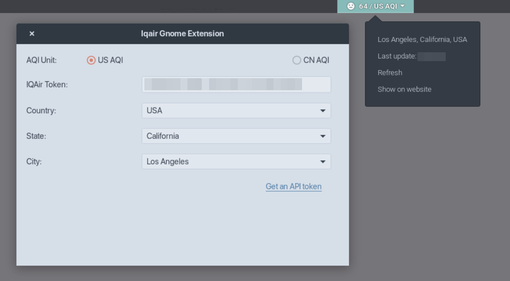

Iqair Gnome Extension
==================

 

Gnome extension for tracking air quality in real-time. data provider: [iqair.com](https://iqair.com/)

## ScreenShot

## Installation

## How to use?

1. Sign up IQAir account from [here](https://www.iqair.com/auth/signup)
2. Get API token from [here](https://www.iqair.com/dashboard/api)
3. Set up Token, Country, State, City in extension settings.
4. Click refresh IQAir in extension's drop menu.

## LICENSE

